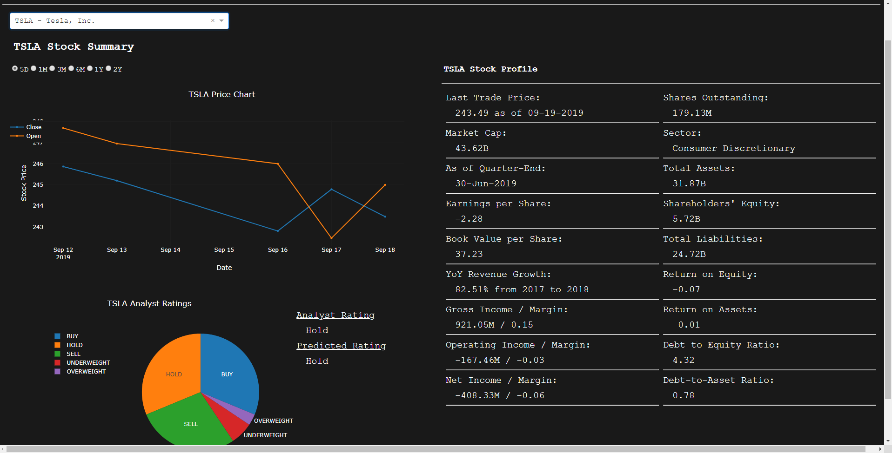
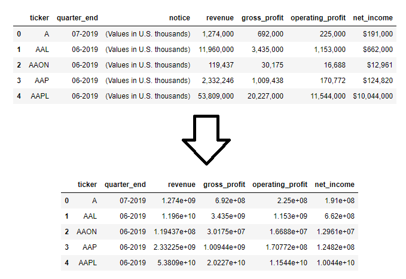

# Stock Dashboard: End-to-End Machine Learning Pipeline

## Getting Started

Researching stocks can be time consuming and not all apps display the financial metrics we are interested in. This dashboard was built to increase productivity around researching and selecting stocks to optimize returns. This app explores the correlation between a company's financial metrics to its anticipated performance. Using machine learning this application solves the multi-classification problem of whether to Buy, Sell, or Hold a stock. Although a company's financials determines its health, stocks are generally priced based on future values and the risks and randomness in a stock's prices can not eliminated. Investment decisions should be made with discretion.

The front-end dashboard was built using Plotly/Dash on Python and has been deployed on Heroku for your viewing at https://stock-dashboard-ikim91.herokuapp.com.

The dashboard template can be seen in the image below.

The end-to-end machine learning pipeline of the project is summarized in the figure below.

It is also important to note that not all of the financial data may be up-to-date. All of the financial data was extracted on September 2019.

## Data Preparation

In this part of the pipeline we focus on extracting, transforming and loading data from different sources so that it can be used in our machine learning model.

#### Web Scrape and Extract: [s&p500_companies.ipynb](./s&p500_companies.ipynb)

For this process we web scrape from Wikipedia to get a list companies in the S&P500. We extract the company name, company ticker symbol, and its GICS sector code into a NumPys Array, which is then converted into a Pandas DataFrame.

#### Extract and Consolidate Databases: [olddatabase_transfer.ipynb](./olddatabase_transfer.ipynb)

Next we extract data from an older database, which includes a list of hand picked stocks trading on the NYSE and Nasdaq. The list of the S&P500 companies and the list of companies from the old database are concatenated and filtered by ticker symbol, dropping any duplicate data. The new list of companies are stored into a SQL Database.

#### Web Scrape and Extract Financial Data: [extract_features.ipynb](./extract_features.ipynb) / [extract_additional_features.ipynb](./extract_additional_features.ipynb)

In this process we extract financial data. We are gathering as much information as we can for feature engineering in later stages when we begin to evaluate our model. By web scraping from Yahoo Finance, Market Watch, and Barchart, we extract the following information:
  - Revenue & Expenses
  - Gross, Operating, Net Profits
  - Assets, Intangible Assets, Liabilities, Equity
  - Number of Shares Outstanding
  - Analyst Ratings for stock

The data is temporarily stored into CSV files for the data preprocessing phase.

## Data Preprocessing

In this part of the pipeline we clean and transform our data so that we can start applying feature engineering for our machine learning model.

#### Clean and Transform Data: [transform_data.ipynb](./transform_data.ipynb)

Previously we used web scraping to extract financial data. Most of the data we will be working with is numerical but have been extracted as String datatypes. For example, numerical values formatted using commas, dollar signs, or letters. We need to convert them into numerical Float datatypes.

Next we notice that not all of our data is denoted in the same currencies. For sake of consistency, I converted all the data into USDs. By web scraping the exchange rate of each currency, we can write a script using a for-loop to automate this process. After converting all the data into the same denominations, we transfer our financial data into our SQL database for later use.

The figure below shows an example of how our dataset is transformed.

After cleaning and transforming our dataset, we have 6 tables in our SQL Database. For this project we will be utilizing ElephantSQL for our database needs and psycopg2 on Python for querying our database. The schema of all our SQL tables are illustrated below.

#### Create Features, Handle Missing Values, Remove Outliers, Imbalanced Dataset, Encoding Categorical Data and Feature Scale: [model_evaluation.ipynb](./model_evaluation.ipynb)

For the first part of the model evaluation pipeline, we perform more advanced data preprocessing such as creating new features, handling with missing data, removing outliers, handling an imbalanced dataset, encoding categorical data, and feature scaling.

Using the features we extracted in the previous stage we can create new features to help generalize our data better. Based on domain knowledge, I based the new features on 3 key metrics: Profitability, Liquidity/Financial Leverage, and Growth. Stocks are generally measured against an index or against other similar companies within the same sector. For this reason I used the sector codes as one of the features, using the get_dummies method from Pandas to encode the categorical data. Other features I use are as follows:
  - Earnings per Share (col 10)
  - Tangible Book Value per Share (col 11)
  - Return on Equity (col 12)
  - Return on Assets (col 13)
  - Debt-to-Equity (col 14)
  - Debt-to-Asset (col 15)
  - Gross, Operating, and Net Margins (cols 16, 17, 18)
  - Year-over-year Revenue Growth (col 19)

First we check for missing values and drop missing values from our dataset. Next we want to get an idea of what our dataset looks like. By using Pandas we can get a summarized table illustrated below.

Based on the table above we can draw a few conclusions and place a few data constraints. First we look at the gross, operating and net margin columns (16, 17, 18). Margins are profitability ratios meaning that a margin of 1.0 represents a company operating at 100% efficiencies. This is unlikely and we can assume that it is due to misrepresented data in the financial statement. So based on our assumption we will drop any data points with margins greater than 1.0.

Looking at the quantile ranges, we can see large contrasts between the min and max against the data within the 25% to 75% quantile range. There are extreme outliers in our datasets. For example we see the max value for columns 10 and 11 which are earnings per share and book value per share. These are the values for the company Berkshire Hathaway (BRK.A), which has never done a stock split since being founded in 1839. There are no other companies, or very few companies that have this kind of characteristic. We will drop any extreme outliers within our dataset by dropping any data points that falls outside of the 1% to 99% quantile range. This gives us a better representation of our data.

After placing our data constraints and removing our outliers, we can see the new summarized dataset below:

Next we will preprocess our target values, the stock ratings. In the financial industry, companies are rated on a 5 point scale, from Strong Sell, Moderate Sell, Hold, Moderate Buy, and Strong Buy. First we will need to encode this representation into numerical data but we will first consolidate our data into 3 classes to help the model generalize better. The encoding is illustrated in the image below.

Next we perform feature scaling on our dataset and perform a 80/20 train-test split.

From encoding our target values, we can see that we are dealing with an imbalanced dataset with a 340:129:43 ratio, with the majority class being Buy ratings. This is evident when we fit a logistic regression to our data without accounting for the imbalanced class distribution. Although our model is able to predict with a 65% accuracy, this is due to the fact that our model is predicting every prediction as a Buy rating.

We will be employing undersampling and SMOTE methods to fix this. Using the undersampling method, our model is now predicting at an average of 42% accuracy score with a standard deviation of 13%. This is not a great model suffering from underfitting. Next, by utilizing an oversampling method, SMOTE, we get an average accuracy score of 51% and a standard deviation of 5%.

## Model Optimization and Model Selection

Selecting the best machine learning model for deployment.

#### Train, Fit, Evaluate, Repeat: [model_evaluation.ipynb](./model_evaluation.ipynb)

From the data preprocessing pipeline, we now have a set of clean features that have been feature scaled and split into a training and test set. We have also employed SMOTE to account for the imbalanced dataset. We will now start optimizing our model to find the best model for our problem.

So far our bench mark is an accuracy score of 51% using logistic regression.

Using grid search, we can tune our hyperparameters to further optimize our model. We can also use the backward elimination method to perform feature selection. The Adjusted R-squared value of our model is 0.700. This means that our features does a moderately good job fitting to our model. All our features are within the significance level with a p-value less than 0.05. This means that we do not need to remove any features as it will not further optimize our model's performance.

Our new bench mark after Grid Search and Feature Selection is 58%, an increase of 7% in performance.

Next we will try using a Random Forest model to see if our model performs any better. Using Random Forest, we are able to achieve an accuracy score of 77% with a standard deviation of 4%. This is an increase of 19% from our previous model.

The model we will use for deployment will be the random forest classifier. The model is extracted using pickle on Python and our min/max values are also stored in CSV files so that we can perform feature scaling when making future predictions.

## Model Prediction and Deployment

Making predictions and deploying our dashboard.

#### Predict Using Model: [predict_ratings.ipynb](./predict_ratings.ipynb)

Here we will predict all of the ratings for the list of companies we have in our database for deployment. Using the join query on SQL, we can query all the necessary data into 1 or 2 tables. We then build our features as we have done previously for all the companies in our database.

We then load the optimized random forest model selected from the previous stage using the pickle library on Python. We also load the maximum and minimum values used when we feature scaled during the model selection process. We now have all the information required to start making predictions using our machine learning model.

Once all the company ratings have been predicted we transfer the predictions into our database for our front-end dashboard to use.

#### Deploy Dashboard: [stock_dashboard.py](./stock_dashboard.py)

Dash is a Python Framework built on Plotly for data visualization. The dashboard was built using Dash and has been deployed using Heroku. Our dashboard is connected to our database so that we can search through a list of all the companies in our database. The contents of our dashboard includes a stock price chart viewable by 5 Day, 1 Month, 3 Month, 6 Month and 1 Year from the current date. It also includes all the financial metrics used in evaluating our machine learning model.

## Closing Thoughts

We concluded that we were able to fit a moderate relationship between a company's financial health and its rating. We were able to get an Adjusted R-squared value of ~0.70 but could not do much better. There are a couple of things to note when trying to predict a stock's rating. First, even though a company that is financially healthy is more likely to have a Buy rating over a company that is financially unhealthy, the company financials does not encapsulate the full relationship. That is why we are unable to get an accuracy score much higher than what we were able to achieve in model optimization. Second, the ratings as recommended by analysts are also based on preferences. Different analysts have different views about different stocks and there are always room for error. Our model is unable to predict the sentiment of analysts.

As always any investment decisions should be made with discretion.

## License

The MIT License (MIT)

Copyright 2018 Chris Kim

Permission is hereby granted, free of charge, to any person obtaining a copy of this software and associated documentation files (the "Software"), to deal in the Software without restriction, including without limitation the rights to use, copy, modify, merge, publish, distribute, sublicense, and/or sell copies of the Software, and to permit persons to whom the Software is furnished to do so, subject to the following conditions:

The above copyright notice and this permission notice shall be included in all copies or substantial portions of the Software.

THE SOFTWARE IS PROVIDED "AS IS", WITHOUT WARRANTY OF ANY KIND, EXPRESS OR IMPLIED, INCLUDING BUT NOT LIMITED TO THE WARRANTIES OF MERCHANTABILITY, ITNESS FOR A PARTICULAR PURPOSE AND NONINFRINGEMENT. IN NO EVENT SHALL THE AUTHORS OR COPYRIGHT HOLDERS BE LIABLE FOR ANY CLAIM, DAMAGES OR OTHER LIABILITY, WHETHER IN AN ACTION OF CONTRACT, TORT OR OTHERWISE, ARISING FROM, OUT OF OR IN CONNECTION WITH THE SOFTWARE OR THE USE OR OTHER DEALINGS IN THE SOFTWARE.
